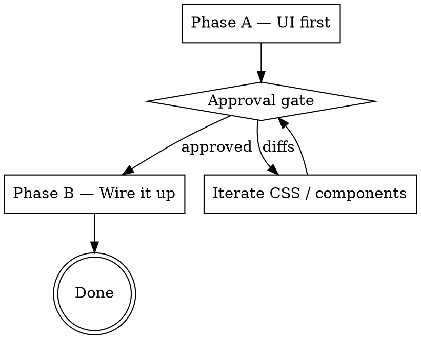

# Pressbooks Studio Screen

## Overview

Build a real Pressbooks Studio screen from a Claude-design prototype by
extracting only the components that screen needs, mapping prototype CSS
to existing tokens, and shipping the full backend wiring — but only
after the static UI is approved by the user.

**Core principle:** UI before behavior. Visual changes are cheap; wired
changes are expensive. Approve the layout, then wire it.

## When to use

- The user asks to build / port / implement any prototype from `docs/microcredentials-exploration/project/*.jsx` into the live Studio.
- The user asks for a new `mc-studio-*` page.
- The user wants to replace a Studio placeholder screen with the real thing.

**Do NOT use for:**
- Overlays / modals / wizards on top of a screen → `docs/studio/adding-an-overlay.md`
- Pure REST endpoint work → `docs/studio/rest-controllers.md`
- Chrome / sidebar / topbar changes (those are not screens)
- Anything outside `pressbooks-microcredentials/`

## Required background reading

Before doing anything, read these three repo docs once:

1. `docs/studio/AGENTS.md` — Studio overview, screen mount contract, MenuContext rules
2. `docs/studio/adding-a-screen.md` — the canonical 6-step recipe (this skill specializes it)
3. `docs/studio/css-and-icons.md` — token discipline + icon partial contract

This skill **extends** those docs. When they conflict, the docs win.

If the screen gives any feedback (save, success, error, confirm, loading,
task-in-progress), also read the "Interaction-feedback vocabulary (Issue
#108)" section of `docs/studio/AGENTS.md` and the prototype it points to
(`docs/microcredentials-exploration/project/Microcredentials - Microinteractions.html`).
That vocabulary is the Studio-wide standard — adopt it, don't invent
per-screen feedback.

## The 2-phase flow

Never jump straight to Phase B. Never wire data, REST, or Alpine before
the user confirms the visual is right.

## Workflow

Create one `todowrite` per phase step up front. Then follow them in order.

### Phase A — UI first (5 steps)

Read `references/phase-a-ui-first.md` for the full step-by-step.

| Step | Output |
|------|--------|
| A1 | Read context (3 docs above) |
| A2 | Read prototype (.jsx + .html + relevant styles.css) |
| A3 | Run the three DRY gates → extract only missing components/tokens/icons |
| A4 | Register menu item + StudioScreen + Blade view with **inline `$fixtures`** |
| A5 | Add screen's CSS block to `assets/src/styles/studio.css` |

### Approval gate

When Phase A is complete, **stop**. Use the prompt template in
`references/approval-gate.md`. Do not proceed until the user explicitly
approves.

### Phase B — Wire it up (6 steps, only after approval)

Read `references/phase-b-wire-it-up.md` for the full step-by-step.

| Step | Output |
|------|--------|
| B1 | Create `<Name>ViewModel` in `src/Studio/Screens/`; replace `$fixtures` |
| B2 | Decide interactivity (read-only-current-site skips B3+B4) |
| B3 | REST controller in `src/Api/` (if needed) |
| B4 | Alpine controller in `studio.js` (if needed) |
| B5 | Tests: router + menu + view-renders + landmarks (+ REST tests) |
| B6 | Final verification: `composer test && composer lint && npm run build` |

## DRY gates (mandatory)

Before adding ANY component, token, or icon, run the corresponding gate
in `references/dry-check.md`. Reusing > adding. The user will reject a
screen that adds duplicates of existing primitives.

## Reference files

- `references/phase-a-ui-first.md` — 5-step UI recipe
- `references/phase-b-wire-it-up.md` — 6-step wiring recipe
- `references/approval-gate.md` — exact pause prompt + checklist
- `references/dry-check.md` — three DRY gates (components / tokens / icons)
- `references/component-catalog.md` — known prototype → target mappings (grows over time)
- `references/token-mapping.md` — prototype CSS values → existing tokens
- `references/phase-d-lessons.md` — patterns and gotchas learned during Phase D (Blade, Alpine, DnD, WP/REST, Vite, i18n, testing, workflow). **Read before any non-trivial wiring.**
- `references/templates/` — boilerplate snippets (menu-item, view-model, REST controller, Alpine factory, tests, CSS block)
- `references/examples/organize-walkthrough.md` — worked example end-to-end

## Conventions (locked in)

- **Slugs:** `mc-studio-<name>` (rule from `StudioGate`)
- **View path:** `studio::screens.<name>` → `resources/views/studio/screens/<name>.blade.php`
- **Component path:** `studio::components.<name>` → `resources/views/studio/components/<name>.blade.php`
- **Component classes:** `mc-*` (BEM-ish, matches prototypes)
- **Chrome classes:** `studio-*` (do not touch from screens)
- **View models:** `src/Studio/Screens/<Name>ViewModel.php`
- **REST controllers:** `src/Api/<Name>Controller.php`
- **Icons:** always via `@include('studio::partials.icon', ['icon' => 'dashicons-…'])` — never raw SVG in a screen
- **Tokens:** `--pb-*` (brand) and `--studio-*` (chrome). No hex / px literals in screen CSS
- **Feedback states:** use the shared interaction-feedback vocabulary (loading / success / error / confirmation / task-in-progress) — toast vs. inline banner vs. status pill, optimistic + snap-back, inline-confirm vs. one shared modal. Source of truth: the "Interaction-feedback vocabulary" section of `docs/studio/AGENTS.md`. Never `alert()`, never a silent save
- **Fixtures (Phase A):** inline array inside the screen view via Blade `@php` block, comment-marked `{{-- PHASE A FIXTURES — replace in B1. --}}`
- **HMR:** approval gate reminds user to run `npm run watch`; `npm run build` is for B6 only

## Cardinal rule

Screen views render content **only**. Never wrap in `<main>`, never
recreate chrome, never emit `<html>`/`<body>`. The layout
(`resources/views/studio/layout.blade.php`) wraps you.

## Bucket-close discipline (for multi-bucket work)

If the screen you're building spans multiple buckets (anything beyond a
trivial read-only screen), **you owe a closing bucket.** This is the
single most-skipped piece of Studio work and the single most-regretted.

A closing bucket contains four tasks:

1. Update `docs/studio/rest-controllers.md` with every endpoint you added.
2. Update `docs/studio/AGENTS.md` with every new BEM block, pattern, or convention.
3. Populate `docs/studio/OPEN-QUESTIONS.md` with every deferred decision.
4. Run a clean-checkout verification (`rm -rf node_modules vendor && composer install && npm install && composer test && composer lint && npm run lint:scripts && npm run build`).

**The feature is done when the last feature bucket ships. The phase is done only after the closing bucket.** These are different. Conflating them is the failure mode.

See `docs/studio/AGENTS.md` § "Phase closure" for the full rationalization-counter table. If you find yourself thinking "the docs can be a follow-up PR" or "let me log the most important OPEN-Qs and skip the rest," stop and re-read that section.

The Phase D plan (`docs/superpowers/plans/2026-05-23-studio-organize-phase-d.md` § "Bucket D.8") is the canonical example.

## Red flags — STOP if you find yourself…

| Thought | Reality |
|---------|---------|
| "I'll skip the approval gate, it's a small screen" | The gate is the whole point. Stop. |
| "Let me add a new token, it's just one color" | Run the token DRY gate first. |
| "I'll create `mc-status-pill.blade.php` real quick" | Search components first. It may exist. |
| "Phase B can start while user reviews Phase A" | Phase B is forbidden until approval. |
| "I'll wire REST first to know the data shape" | Fixtures shape Phase A. View model shapes B1. |
| "The placeholder view test is fine" | Phase B5 requires landmark assertions. |
| "I'll inline a hex value here, just one" | Add the token or reuse one. Hex literals fail review. |
| "The prototype uses raw `<svg>`, so I will too" | Always go through `studio::partials.icon`. |
| "I'll drop a quick success banner / `alert()` here" | Use the shared interaction-feedback vocabulary. See the "Interaction-feedback vocabulary" section of `docs/studio/AGENTS.md`. |
| "I'll skip reading the 3 docs, I remember them" | Re-read. Conventions evolve. |
| "I'll fork this Alpine component, it's almost what I need" | Fix upstream. Forking compounds maintenance. See `phase-d-lessons.md` § "Component reuse." |
| "I'll mutate the DOM during keyboard DnD preview" | No. Announce only. Drop is the sole write moment. See `phase-d-lessons.md` § "Keyboard DnD." |
| "I'll skip the DB transaction on this cross-parent move, it's simple" | Atomicity is non-negotiable. See `phase-d-lessons.md` § "DnD endpoint atomicity." |
| "I'll hardcode the asset path, manifest lookup is overkill" | The manifest exists for a reason. See `phase-d-lessons.md` § "Vite manifest discipline." |
| "I'll use sprintf with a noun placeholder for these N strings" | Use N fully-translated literals. See `phase-d-lessons.md` § "i18n preference." |
| "The closing bucket can be a follow-up PR" | No. See `docs/studio/AGENTS.md` § "Phase closure." |
| "Let me log the top 3–5 OPEN-Qs and skip the rest" | All of them. The 'unimportant' ones are exactly the ones that bite later. |
| "The clean-checkout rebuild is overkill" | It catches what CI misses (lockfile drift, install-order bugs, Vite manifest drift). |
| "I just deleted that method, the diff must be right" | Verify `git diff --stat`. Matching context can silently re-insert. See `phase-d-lessons.md` § "Edit-tool safety." |

## Out of scope (defer)

- Lexical editor wiring — produce a `

` mount point with a TODO comment pointing at a future `pressbooks-studio-lexical` skill.
- Modal/overlay logic — defer to `docs/studio/adding-an-overlay.md`.
- New tokens that don't recur ≥2× in the screen → reuse the closest existing one.

## When in doubt

Ask the user. Especially: which prototype, which slug, and whether the
screen should be Root-context or Course-context (see decision table in
`docs/studio/adding-a-screen.md`).
